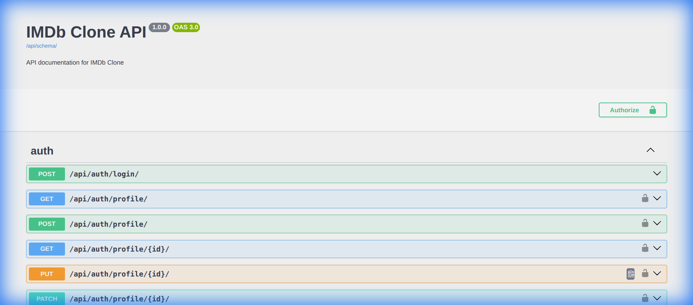

# IMDb Clone API 🎬

A scalable, high-performance RESTful API for a movie database. Built with Django Rest Framework, optimized with Redis caching, secured with JWT, and documented with Open API (Swagger).



## 🚀 Key Features

*   **Authentication:** Custom User Model with JWT (Access/Refresh tokens) via `simplejwt`.
*   **Performance:**
    *   **Redis Caching:** Sub-millisecond response times for low-churn endpoints (Genres, Persons).
    *   **Rate Limiting:** Protects against abuse (Anon: 100/day, User: 1000/day, Reviews: 10/min).
    *   **Database Optimization:** `prefetch_related` to eliminate N+1 query problems.
*   **Documentation:** Fully interactive Swagger UI and Redoc.
*   **Data Population:** Custom command to generate thousands of dummy records for stress testing.
*   **Background Tasks:** Celery + Redis architecture ready (e.g., for email).

## 🛠 Tech Stack

*   **Backend:** Python 3.12+, Django 6.0, Django REST Framework
*   **Database:** SQLite (Dev), PostgreSQL (Prod Ready)
*   **Caching & Broker:** Redis
*   **Dependencies:** `drf-spectacular`, `faker`, `django-redis`

## ⚙️ Installation & Setup

1.  **Clone the repo**
    ```bash
    git clone https://github.com/prachanda980/imdb-clone.git
    cd imdb-clone
    ```

2.  **Setup Environment**
    ```bash
    python3 -m venv venv
    source venv/bin/activate  # Windows: venv\Scripts\activate
    ```

3.  **Install Dependencies**
    ```bash
    pip install -r requirements.txt
    ```

4.  **Configuration**
    Copy the example env file and update if necessary:
    ```bash
    cp .env.example .env
    ```
    *Ensure Redis is running locally on default port 6379.*

5.  **Database & Admin**
    ```bash
    python manage.py migrate
    python manage.py createsuperuser
    ```

6.  **Run Dev Server**
    ```bash
    python manage.py runserver
    ```

## ⚡️ Data Population (Dummy Data)

To test performance or UI, you can generate **1000+ movies** with realistic data (Genres, Actors, Crew, Ratings) using the built-in command:

```bash
python manage.py populate_movies
```

*This uses the `Faker` library to generate randomized content.*

## 📚 API Documentation

Access the interactive API documentation at:

*   **Swagger UI:** [http://localhost:8000/api/schema/swagger-ui/](http://localhost:8000/api/schema/swagger-ui/)
*   **ReDoc:** [http://localhost:8000/api/schema/redoc/](http://localhost:8000/api/schema/redoc/)

### Rate Limiting Policies
| User Type | Rate Limit | Scope |
| :--- | :--- | :--- |
| **Anonymous** | 100 requests / day | Global |
| **Authenticated** | 1000 requests / day | Global |
| **Review Creation** | 10 requests / minute | `apps.movies.api.views.ReviewViewSet` |

### Caching Policies
| Endpoint | Cache Duration |
| :--- | :--- |
| `GET /api/v1/genres/` | 1 Hour (60m) |
| `GET /api/v1/persons/` | 15 Minutes |
| `GET /api/v1/movies/` | 15 Minutes (Manual key `movies:list`) |

*Note: Caches are invalidated automatically on Create/Update/Delete operations.*

## 📡 Key Endpoints

| Method | Endpoint | Description |
| :--- | :--- | :--- |
| **POST** | `/api/auth/token/` | Obtain Access/Refresh Tokens |
| **POST** | `/api/auth/token/refresh/` | Refresh Access Token |
| **GET** | `/api/v1/movies/` | List all movies (Cached, Pagination) |
| **GET** | `/api/v1/movies/{id}/` | Get movie detail (Cached) |
| **POST** | `/api/v1/movies/{id}/reviews/` | Add review (Throttled) |
| **POST** | `/api/v1/movies/{id}/crew/` | Link Person to Movie (Director/Actor) |

## 🧪 Testing

Run the comprehensive test suite (Functional + Optimization checks):

```bash
python manage.py test
```
*   **Result:** 14 Tests (Coverage: Auth, CRUD, Caching, Throttling, Relations)
